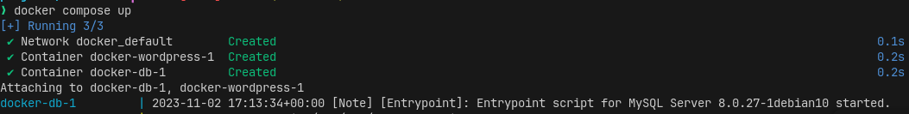
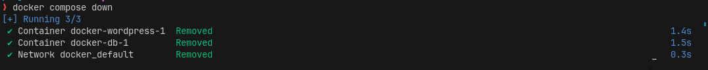
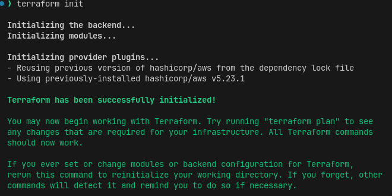
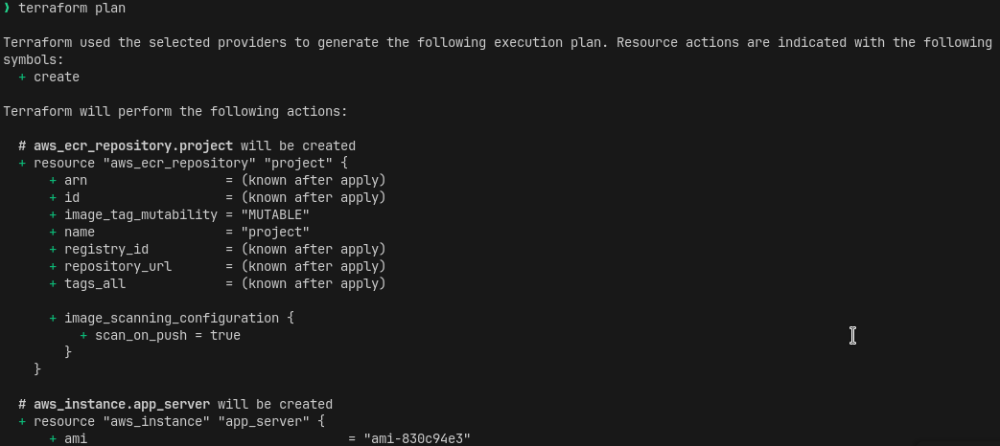
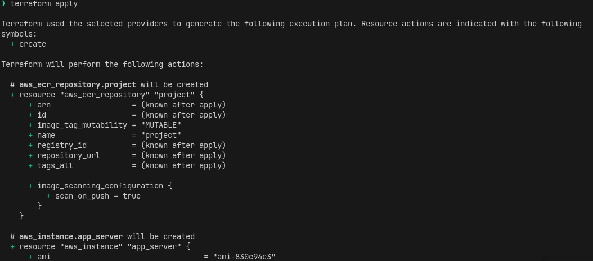
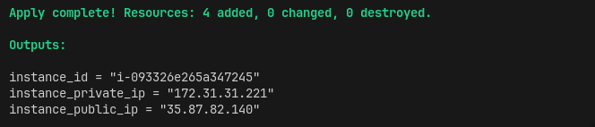
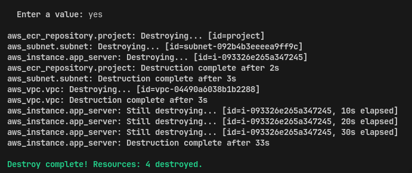

# PROJECT

**Docker**

Move to the directory containing the docker compose.yaml file.

To create container with services on a docker network.
Type `docker compose up`

To remove containers with services 
Type `docker compose down` 

**Terraform**
Create an aws instance with s3 bucket and vpc.

1. cd into the terraform directory inside the project- folder 
   .../project-/terraform
2. Run `terraform init` to initialize the directory.

3. Run `terraform plan` to confirm what terraform is creating.

4. Run `terraform apply` to create.

5. Confirm the instance, bucket and vpc has been createdin aws.

When it has been created you should see output information like this.

To terminate all sevices, use `terraform desroy` and reply yes when promted.

When successful you should have a similar feedback to this.

